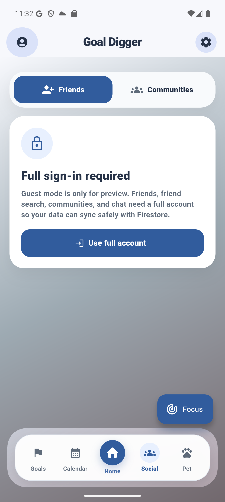

# Goal Digger

Goal Digger is an agentic AI productivity companion app built with Flutter, Firebase, Genkit, and Gemini. It helps a user turn goals into scheduled micro-tasks, adapt work around mood and routines, focus with Android app blocking, earn companion rewards, collaborate with friends and communities, receive smart notifications, and optionally sync tasks to Google Calendar.

Android is the primary, fully featured target. The repository also contains generated Flutter folders for web, iOS, macOS, Linux, and Windows, but the native focus blocker and local notification scheduler are Android-specific.



## What Is In This Repository

```text
.
|-- android/                      Android app, notification bridge, focus blocker
|-- assets/                       Companion sprite sheets and Plus Jakarta Sans
|-- functions/                    Firebase Functions, Genkit flows, agents, notification triage
|-- ios/ macos/ linux/ windows/   Generated Flutter platform folders
|-- lib/
|   |-- app/                      App root, shell wiring, goal planning workflow
|   |-- core/                     Constants, theme, date helpers
|   |-- data/                     Demo seed goals used before synced data loads
|   |-- features/                 UI features: goals, home, calendar, social, pet, focus, profile, settings, notifications
|   |-- firebase/                 Firebase init, auth, Firestore repositories, app sync service
|   |-- genkit/                   Typed Flutter wrappers for AI Cloud Functions
|   |-- models/                   Shared app models
|   |-- services/                 Google Calendar REST service
|   |-- shared/                   Shared widgets
|-- firebase.json                 Firebase project, emulator, rules, indexes, functions config
|-- firestore.rules               Firestore security rules
|-- firestore.indexes.json        Firestore indexes
|-- pubspec.yaml                  Flutter dependencies, assets, fonts
```

## Feature Map

| Area | Implemented features |
| --- | --- |
| Onboarding and auth | Email/password login and signup, Google sign-in, anonymous guest mode, password reset, Firebase Auth state handling. |
| Goals | Goal creation with title, category, priority, deadline, AI-generated task plan review, edit deadline, edit priority, search goals, delete goals. |
| Agentic planning | Goal guard, deadline feasibility check, AI milestone generation, chat-style plan edits, task reassignment, memory, deterministic fallbacks. |
| Home | Mood check, today's task groups, progress, remaining minutes, one-way task completion confirmation, streaks, coins, companion happiness. |
| Calendar | Month grid, daily agenda, recurring routines, fixed-commitment display, single-task and bulk Google Calendar task sync. |
| Focus | Task-linked or custom focus sessions, presets/custom duration, pause/resume/minimize/stop, Android timer notification, optional app blocking. |
| Pet | Animated companion, happiness, feeding, companion switching, capsule/gacha unlocks, duplicate refunds, rarity tiers, streak-based sprites. |
| Social | Public profiles, friend search, direct chats, community creation, join codes, community chat, member profiles, leaderboards, AI social ranking. |
| Notifications | Firestore inbox, important grouping, unread badge, mark read/all-read/delete, Android scheduled notifications, FCM token storage, push triage agent. |
| Profile and settings | Display name, guest upgrade, email verification, password reset, account deletion, theme mode, notification controls, Google Calendar connection. |

## App Shell

The main signed-in experience uses five bottom tabs:

- `Goals`: create and manage goals.
- `Calendar`: inspect scheduled work and routines.
- `Home`: mood-aware daily task dashboard.
- `Social`: friends, chats, communities, and leaderboards.
- `Pet`: companion rewards and collection.

The top app chrome opens profile, settings, and the notification inbox. A floating Focus action starts or resumes a focus session. Active focus sessions show a banner and a live countdown label in the shell.

## Onboarding, Accounts, And Profiles

Goal Digger uses Firebase Auth for every session, including guest preview mode.

Implemented auth flows:

- Email/password account creation and login.
- Google sign-in.
- Anonymous guest sign-in.
- Password reset from onboarding, profile, and settings.
- Guest upgrade to email/password while preserving progress when Firebase credential linking succeeds.
- Guest upgrade to Google while preserving progress when credential linking succeeds.
- Display name editing for non-guest accounts.
- Email verification send and refresh.
- Account deletion with password reauthentication when Firebase requires recent login.
- Sign out.

Guest users can preview the app. Full social features such as friend search, real direct chat, and community writes require a non-anonymous account.

Profile surfaces include:

- Display name, email, photo URL, provider status, and verification status.
- Coins, streak, companion, selected mood, goals, tasks, communities, and friends.
- Achievement-style badges based on streak, completion, friends, focus minutes, and community activity.
- Social/privacy controls for friend progress sharing.
- Goal reminder preference.
- Guest upgrade panel for binding the guest session to Google or email/password.
- Danger-zone actions for sign out and account deletion.

## Goals And Tasks

Goal creation captures:

- Goal title.
- Category: `Study`, `Career`, `Wellness`, `Finance`, `Creative`, or `Other`.
- Priority from 1 to 5.
- Deadline date.

Each saved goal contains:

- Integer `id`.
- `title`.
- `importance`.
- `category`.
- `deadline`.
- Gradient colors.
- `progress`.
- Embedded `tasksMap` keyed by task id.

Each task contains:

- Integer `id`.
- Parent `goalId`.
- `title`.
- `durationMinutes`.
- `scheduledDate`.
- `done`.
- `points`.
- Optional `completedAt`.
- Load: `Light`, `Focus`, or `Stretch`.

The Goals tab shows active goals sorted by nearest deadline, with search, progress, category, priority, deadline, completed-task counts, and a task preview. Users can edit a goal deadline, edit priority, or delete a goal.

Task completion is intentionally one-way in the UI. The Home tab asks for confirmation before marking a task complete. Completing a task:

- Sets `done` and `completedAt`.
- Awards the task's points as coins.
- Adds companion happiness.
- Updates the streak.
- Marks joined communities active for the day.
- Persists the task state to Firestore.
- Reschedules local Android notifications.

## Agentic AI Planning

The app's goal creation flow is agent-first. A goal is not saved immediately after the user types it. Instead, the app opens a planning dialog and calls the backend `agentPlanner` function.

Planning context sent from Flutter includes goal metadata and current app state such as category, priority, deadline length, selected mood, completed/today task counts, streak, and existing scheduled daily minutes. The backend uses that context to decide feasibility and scheduling.

The planning pipeline:

1. `goal_guard.ts` evaluates the goal before any task generation.
2. The guard rejects goals that are unclear, too broad, impossible, harmful, or negatively framed.
3. Allowed goals can still receive a deadline suggestion if the selected deadline is unrealistic.
4. `planner.ts` chooses which tools to run.
5. `runtime.ts` executes selected tools and chains useful outputs between them.
6. `createMilestones` generates structured task milestones.
7. `analyzeHabits` estimates burnout risk, strongest hours, and a productivity insight.
8. `scheduleTasks` calculates deterministic session spacing.
9. `reflection.ts` produces concise user-facing reflections.
10. Agent memory is written to `agent_memory/{uid}` by the backend Admin SDK.

The app displays generated tasks in a plan review dialog before committing them. The user can ask for changes inside that dialog. Those edits call `agentModify`, which can:

- Apply a clear, realistic change.
- Ask a clarifying question.
- Ask for confirmation when a change is possible but risky.
- Reject unrealistic or unsafe changes.

Hard safety rules are enforced in code, not only prompts:

- No task may be scheduled past the deadline window.
- Durations are clamped into sane bounds.
- Task counts are capped.
- Reassignment respects mood-based daily capacity.
- Higher-priority goals get scheduling preference when proposals conflict.

Fallback behavior is explicit:

- If milestone generation returns no usable tasks, the app can try `taskGenerator`.
- If task generation fails after a valid planning path, deterministic task templates are available.
- If the goal guard cannot verify the goal, the app does not silently create tasks.
- If the modification agent is unavailable, the dialog can attempt a full re-plan.
- Reassignment has a deterministic overload-relief fallback.

## Home And Mood-Aware Tasks

The Home tab is the daily work surface. It shows:

- Mood check.
- Today's completion progress.
- Number of completed tasks.
- Total scheduled tasks for today.
- Remaining scheduled minutes.
- Tasks grouped by goal.
- Per-goal progress and metadata.

The visible mood choices are:

- `Tired`.
- `Okay`.
- `Great`.

Mood affects the UI and backend:

- Tired mode shows smaller first-step guidance and shorter adjusted minutes for heavy tasks.
- Great mode encourages deeper focus on non-light tasks.
- Mood is persisted to the user profile.
- Mood changes call `moodAdvisor`.
- Mood changes also call `agentReassign` so unfinished tasks can be moved around current capacity.
- Low-energy mood advice can create important in-app notifications.

## Calendar, Routines, And Google Calendar

The Calendar tab includes:

- Month grid.
- Task and routine density dots.
- Month task count and completed count.
- Selected-day summary.
- Day agenda grouped by goal.
- Fixed commitments card for routines.
- Collapsible task lists for crowded agenda days.
- Single-task Google Calendar sync button.
- Bulk "sync all tasks" button.
- Routine creation and deletion.
- Full routines list.

Routine fields:

- Title.
- Start date.
- Start time.
- Repeat type: `yearly`, `monthly`, `weekly`, `daily`, or `custom`.

Routine matching is date-aware:

- Daily routines appear every day from their start date.
- Weekly routines match weekday.
- Monthly routines match day of month.
- Yearly routines match month and day.
- Custom routines occur only on their selected day.

Adding a routine triggers task reassignment because routines are treated as fixed commitments.

Google Calendar support:

- Settings connects or disconnects a Google Calendar account.
- Calendar sync remains manual.
- A single task can be synced to the user's primary Google Calendar.
- All tasks can be synced in bulk.
- The service checks existing events before inserting duplicates.
- Task events use private extended properties: `source`, `goalId`, `taskId`, and `syncKey`.
- Event timezone is currently `Asia/Taipei`.
- The Google Calendar service also contains a routine event helper with recurrence support, but the visible Calendar UI currently exposes task sync.

The required Google OAuth scope is:

```text
https://www.googleapis.com/auth/calendar.events
```

## Focus Mode

Focus mode can start from:

- An unfinished task scheduled for today.
- A custom focus session.

Duration options:

- Selected task duration.
- 15 minutes.
- 25 minutes.
- 45 minutes.
- 60 minutes.
- Custom duration from 1 to 240 minutes.

Focus session controls:

- Start.
- Pause.
- Resume.
- Minimize without stopping.
- Stop.
- Reopen an active session from the shell.

Android focus support:

- The native layer shows a persistent countdown notification.
- The notification uses a dedicated `goal_digger_focus_timer` channel.
- Optional app blocking uses Android Accessibility with explicit user permission.
- The app picker lists launchable apps, supports search, shows icons when available, and excludes protected/system packages.
- If a blocked app opens during a session, the accessibility service sends the user to the home screen and shows a short toast.
- Focus timer state is restored after boot/app update/time changes when possible.

When a focus session completes, the app can complete the selected task and calls `focusInsight` for an AI reflection. Completed sessions can award additional coins based on duration.

## Companion And Rewards

Lumi is the default unlocked companion. Additional companions can be unlocked through capsule pulls:

- Auri.
- Porc.
- Mush.
- Cels.
- Pyro.
- Gbat.
- Nong.

Companion rarity tiers:

- Common: Auri, Porc.
- Uncommon: Mush, Cels.
- Rare: Pyro, Gbat.
- Epic: Nong.

Gacha economy:

- Capsule cost: 100 coins.
- Duplicate refund: 50 coins.
- Effective rarity weights: Common 68%, Uncommon 20%, Rare 10%, Epic 2%.

Companion care:

- Feeding costs 10 coins.
- Feeding adds 10 happiness.
- Completing a task adds 5 happiness.
- Switching companions applies a 10-point happiness penalty to the previous companion, with a floor of 30.
- Daily happiness decay is 10 after a day with completed work and 20 after a day with no completed work.
- Non-default companions can lock again if their happiness reaches zero.

Sprites:

- Each companion has `low`, `mid`, and `high` sprite tiers.
- Each tier has `idle` and `interacted` animation sheets.
- Streak tier thresholds are low under 7 days, mid from 7 to 13 days, and high from 14 days onward.

## Social, Friends, Chats, And Communities

The Social tab uses Firestore directly for real-time social data. Full access requires a non-anonymous account.

Public profile behavior:

- The app creates and updates `public_profiles/{uid}`.
- Public profiles include display name, username/search text, photo URL, and streak-related fields.
- Signed-in users can read public profiles for search and social display.

Friends:

- Users can search live public profiles.
- AI social ranking uses the `socialSuggestions` function to score friend fit from current goals/activity and candidates.
- Users can add and remove friends.
- Friend and chat lists include active direct chats, even if the other user is not yet stored as a friend.
- Friend leaderboards rank streaks.
- Detail pages show progress, achievements, chat status, and shared communities.

Direct chats:

- Direct chat documents live under `chats/{chatId}`.
- Messages live under `chats/{chatId}/messages/{messageId}`.
- Chat membership is enforced by Firestore rules.
- Sending a message can create a best-effort in-app notification for the recipient.

Communities:

- Communities live under `communities/{communityId}`.
- Users can create communities with a generated join code.
- Users can join by join code.
- Users can leave or delete communities they own.
- Community messages live under `communities/{communityId}/messages/{messageId}`.
- Community detail pages show join code, members, metrics, overview, member profiles, and chat entry points.
- Community leaderboards rank community streaks.
- Community streaks are driven by daily activity: at least half of listed members must be active for the day to qualify.
- Per-user membership records live under `users/{uid}/communities/{communityId}`.

## Notifications

Goal Digger has three notification layers:

- Firestore-backed in-app inbox.
- Android local/system notifications.
- Firebase Cloud Messaging push notifications selected by a backend triage agent.

In-app notification types:

- `dailyPlan`.
- `taskReminder`.
- `streakSaver`.
- `deadlineWarning`.
- `routineReminder`.
- `focusComplete`.
- `moodNudge`.
- `reward`.
- `community`.
- `friend`.
- `chat`.
- `important`.

Inbox behavior:

- Notifications live under `users/{uid}/notifications/{notificationId}`.
- Important unread notifications are grouped at the top.
- The app shell shows unread and important-unread badges.
- Users can mark one notification read.
- Users can mark all notifications read.
- Users can delete notifications.
- Important notifications can surface as snackbars.

Android local scheduling includes:

- Daily plan summaries for the next 7 days with unfinished work.
- Streak saver reminders.
- Deadline warnings and overdue notices.
- Routine reminders.
- Focus completion notifications.

Android notification behavior:

- Runtime permission request for Android 13+.
- Standard and important channels.
- Dedicated focus timer channel.
- Settings shortcut to Android notification settings.
- Saved alarm requests restored after boot, app update, time change, and timezone change.

FCM behavior:

- FCM tokens are saved under `users/{uid}/fcmTokens/{tokenId}`.
- Foreground FCM messages can be displayed through the Android notification bridge.
- Reward push messages are suppressed in the foreground path.

Backend notification agent:

- `sendNotificationPush` runs when a Firestore inbox notification is created.
- `learnNotificationEngagement` runs when a notification becomes read.
- The agent decides between `push_now` and `inbox_only`.
- Policy blocks respect system notification settings, explicit suppress flags, duplicates, rewards, disabled type settings, hourly push budget, and learned low engagement.
- Chat, friend, and community push copy is preserved rather than rewritten by the model.
- Reward notifications remain inbox-only.
- Decisions and engagement stats are written into notification documents and `agent_memory/{uid}`.

## Settings And Theme

Settings includes:

- Appearance selector: Light, Dark, or System.
- Email verification.
- Password reset.
- Linked provider summary.
- Google Calendar connect/disconnect.
- Android notification master switch.
- In-app notification switch.
- Important in-app notification switch.
- Advanced local notification controls for daily plan, streak saver, deadline warnings, routine reminders, and focus completion.
- Daily plan time picker.
- Streak saver time picker.
- Deadline warning lead time.
- Android notification settings shortcut.
- Test notification.
- Sign out.
- Account deletion.

Theme implementation:

- Plus Jakarta Sans is bundled in `assets/fonts/plus_jakarta_sans`.
- Theme mode persists with `shared_preferences`.
- Design tokens live in `lib/core/theme`.
- Shared UI widgets live in `lib/shared/widgets`.

## AI Backend

The AI backend is implemented in Firebase Functions with Genkit and the Google GenAI plugin.

Default model:

```text
googleai/gemini-2.5-flash
```

Function region:

```text
asia-east1
```

Runtime:

```text
Node.js 20
```

Exported functions:

| Function | Type | Purpose |
| --- | --- | --- |
| `goalCoach` | Callable | Conversational goal coaching response with suggested actions. Implemented and wrapped in Flutter, but not currently exposed as its own visible screen. |
| `goalCoachStream` | HTTP SSE | Streaming coach endpoint with manual Firebase ID token verification. |
| `taskGenerator` | Callable | Generates micro-tasks for a goal after goal guard validation; includes deterministic fallback. |
| `moodAdvisor` | Callable | Produces mood-aware advice after mood changes. |
| `focusInsight` | Callable | Produces post-focus-session insight and reward metadata. |
| `socialSuggestions` | Callable | Ranks friend/community candidates by AI fit, with deterministic fallback ranking. |
| `agentPlanner` | Callable | Full agentic planning run: guard, plan, execute tools, reflect, save memory. |
| `agentModify` | Callable | Applies, clarifies, confirms, or rejects edits to the current draft plan. |
| `agentReassign` | Callable | Rebalances unfinished tasks after mood, routine, deadline, priority, or manual context changes. |
| `sendNotificationPush` | Firestore trigger | Runs the notification triage agent for new inbox notifications. |
| `learnNotificationEngagement` | Firestore trigger | Learns from read notifications and updates notification-agent memory. |

Agent tools:

- `analyzeHabits`: estimates burnout risk, productivity insight, and strongest work hours.
- `createMilestones`: generates structured milestone tasks with title, duration, load, and day offset.
- `scheduleTasks`: deterministic session schedule math and recommended daily minutes.

Agent memory:

- Stored at `agent_memory/{uid}`.
- Readable by the owning user.
- Not writable from client SDKs.
- Written by backend Admin SDK.
- Stores last goal, total agent runs, reflection count, preferred work hours, recommended daily minutes, burnout risk, mood history, reassignment audit data, and notification engagement.

## Firebase And Firestore

Configured project information in this repo:

```text
projectId: goaldigger-2026
Firestore database: (default)
Firestore location: asia-east1
Functions region: asia-east1
```

Primary Firestore paths:

| Path | Purpose |
| --- | --- |
| `users/{uid}` | User profile, streak, coins, companion state, mood, notification settings, preferences, friends array, onboarding status. |
| `users/{uid}/goals/{goalId}` | User goals. Tasks are embedded on the goal document in `tasksMap`. |
| `users/{uid}/routines/{routineId}` | Calendar routines. |
| `users/{uid}/notifications/{notificationId}` | In-app notification inbox and notification-agent metadata. |
| `users/{uid}/fcmTokens/{tokenId}` | Firebase Messaging tokens. |
| `users/{uid}/communities/{communityId}` | Per-user community membership records. |
| `public_profiles/{uid}` | Searchable social profile. |
| `chats/{chatId}` | Direct chat documents. |
| `chats/{chatId}/messages/{messageId}` | Direct chat messages. |
| `communities/{communityId}` | Global community documents. |
| `communities/{communityId}/messages/{messageId}` | Community chat messages. |
| `communities/{communityId}/dailyActivity/{dateKey}` | Community streak participation records. |
| `agent_memory/{uid}` | Backend-owned AI memory. |

Rules summary:

- `users/{uid}` is readable by signed-in users and writable only by the owner.
- Owner-only access is enforced for goals, routines, membership records, notifications, and FCM tokens under `users/{uid}`.
- `public_profiles` are readable by signed-in users and writable only by the owner.
- Direct chats are readable/updatable only by chat members.
- Direct chat messages are creatable only by chat members as themselves.
- Communities are readable by signed-in users.
- Community updates allow owners plus validated self-join/self-leave/activity updates.
- Community messages are readable by signed-in users and creatable by the authenticated sender.
- `agent_memory/{uid}` is owner-readable and client-write-disabled.

Indexes are defined in `firestore.indexes.json` for goal sorting, routine sorting, and community ranking queries.

## Android Native Capabilities

Android package and label:

```text
applicationId: com.example.fltr_test
android:label: Goal Digger
```

Platform channels:

| Channel | Dart service | Native implementation |
| --- | --- | --- |
| `goal_digger/notifications` | `AndroidNotificationService` | `MainActivity.kt`, `GoalNotificationScheduler.kt`, notification receivers |
| `goal_digger/focus_blocking` | `FocusAppBlockingService` | `MainActivity.kt`, `FocusBlockAccessibilityService.kt`, `FocusBlockStore.kt`, `FocusTimerNotification.kt` |

Android permissions/services:

- `POST_NOTIFICATIONS` for Android 13+ notification permission.
- `RECEIVE_BOOT_COMPLETED` for restoring scheduled notifications and focus timer state.
- Accessibility service `FocusBlockAccessibilityService` for optional app blocking.
- Package visibility queries for launchable apps so the focus app picker can list installed apps.

## Requirements

- Flutter SDK compatible with Dart `>=3.4.0 <4.0.0`.
- Android Studio or Android SDK for Android builds.
- Firebase project with Auth, Firestore, Functions, App Check, and Firebase Messaging configured.
- Node.js 20 for Firebase Functions.
- Firebase CLI, commonly run as `npx -y firebase-tools@latest`.
- Gemini API key stored as Firebase Functions secret `GEMINI_API_KEY`.

For Google sign-in on Android, add the correct SHA-1/SHA-256 fingerprints for your debug and release signing keys to the Firebase Android app.

For Google Calendar sync, the Google sign-in configuration must allow the `calendar.events` scope listed above.

## Install

Install Flutter dependencies:

```powershell
flutter pub get
```

Install Functions dependencies:

```powershell
cd functions
npm install
cd ..
```

## Run With Real Firebase

The app uses real Firebase unless `USE_FIREBASE_EMULATORS` is set.

```powershell
flutter run
```

Build a release APK:

```powershell
flutter build apk --release
```

Set the Gemini secret before deploying Functions:

```powershell
npx -y firebase-tools@latest functions:secrets:set GEMINI_API_KEY
```

Deploy Firestore rules, indexes, and Functions:

```powershell
npx -y firebase-tools@latest deploy --only firestore,functions
```

## Run With Firebase Emulators

Start emulators:

```powershell
npx -y firebase-tools@latest emulators:start --only auth,firestore,functions
```

Run Flutter against local emulators:

```powershell
flutter run --dart-define=USE_FIREBASE_EMULATORS=true
```

Default emulator ports from `firebase.json`:

| Emulator | Port |
| --- | --- |
| Auth | `9099` |
| Firestore | `8080` |
| Functions | `5001` |
| Emulator UI | `4000` |

The app maps Android emulator traffic to `10.0.2.2`. Other local platforms use `localhost`.

Optional Dart defines:

```text
FIREBASE_AUTH_EMULATOR_PORT
FIRESTORE_EMULATOR_PORT
FIREBASE_FUNCTIONS_EMULATOR_PORT
USE_FIREBASE_APP_CHECK_DEBUG_PROVIDER
RECAPTCHA_SITE_KEY
```

## App Check

Firebase App Check is activated during startup unless emulator mode is enabled.

- Debug provider is used in non-release builds.
- Play Integrity is used for Android release paths.
- DeviceCheck is used for Apple release paths.
- Web can use reCAPTCHA v3 when `RECAPTCHA_SITE_KEY` is provided.

## Build And Test

Flutter analysis:

```powershell
flutter analyze
```

Flutter tests:

```powershell
flutter test
```

Functions build:

```powershell
cd functions
npm run build
cd ..
```

Functions tests:

```powershell
cd functions
npm test
cd ..
```

Current tests include Flutter onboarding widget coverage and Functions notification-triage policy coverage.

## Important Implementation Notes

- Android is the most complete app target.
- Guest mode is Firebase anonymous auth, not purely local state.
- Demo seed goals, routines, friends, and communities are used before real synced data is available.
- Social features require a full non-anonymous account.
- Goal tasks are embedded in `tasksMap`; they are not currently stored in a task subcollection.
- `goalCoach` and `goalCoachStream` are implemented and typed, but the visible app flow mainly uses planning, modification, reassignment, mood advice, social suggestions, task generation, and focus insight.
- Google Calendar sync writes to the primary calendar and uses private extended properties to avoid duplicate task events.
- Android app blocking works only after the user explicitly enables the accessibility service.
- Local Android notifications depend on OS notification permission and channel settings.

## Troubleshooting

### Google sign-in fails on Android

Check that the Firebase Auth Google provider is enabled and that the Android app in Firebase has the correct SHA-1/SHA-256 fingerprints for the signing key used by the build.

### AI calls fail

Confirm that Functions are deployed in `asia-east1`, `GenkitConfig.region` is also `asia-east1`, and the `GEMINI_API_KEY` secret is available to Functions.

### Firestore writes fail

Deploy rules and indexes:

```powershell
npx -y firebase-tools@latest deploy --only firestore
```

Then confirm the user is authenticated and writing only to paths allowed by `firestore.rules`.

### Google Calendar sync fails

Reconnect Google Calendar from Settings, confirm the Calendar API and OAuth consent configuration are valid, and make sure the app can request `https://www.googleapis.com/auth/calendar.events`.

### Android notifications do not appear

Open Settings in the app and use the Android notification settings shortcut. Android 13+ requires runtime notification permission, and the standard, important, or focus timer channel may also be disabled by the OS.

### Focus app blocking does not work

Enable the `Goal Digger App Block` accessibility service in Android Accessibility settings, return to the focus setup sheet, and choose apps to block.

### Emulator networking fails on Android

Use:

```powershell
flutter run --dart-define=USE_FIREBASE_EMULATORS=true
```

The app maps Android emulator traffic to `10.0.2.2` for local Firebase emulators.
